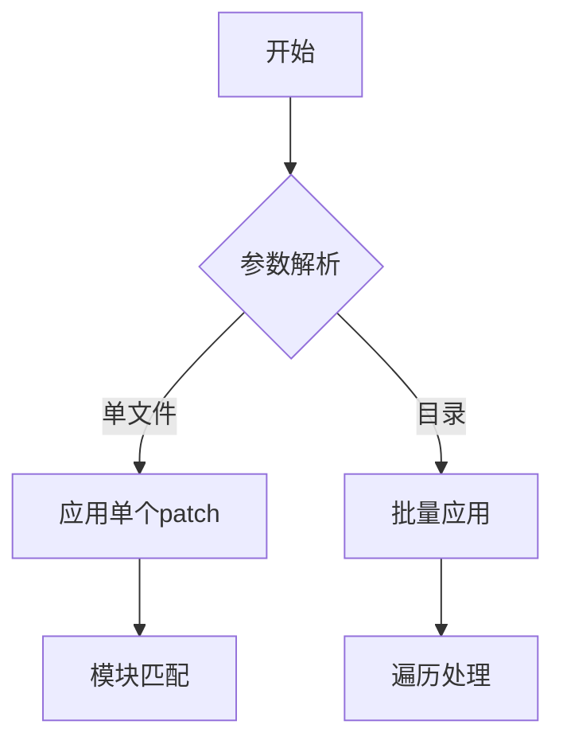

# 编译环境准备

- **基础工具**：
  - [Git (≥2.30)](https://git-scm.com/downloads/win)
  - [Perl (≥5.12)](http://www.activestate.com/activeperl/)
  - [Python (≥2.7)](http://www.activestate.com/activepython/)
  - MinGW-w64 (gcc ≥4.9)
  
- **脚本依赖工具**：
  - 7-Zip (命令行版)
  - cURL (下载工具)
  - unzip (解压工具)

# 工具安装说明

- 基础工具需要用户自行安装（<font color='red'>`编译脚本会检测编译所需工具路径的配置文件`</font>）

- 脚本依赖内置自动安装功能：

  1. 首次运行时会检测缺失工具
  2. 自动从官方镜像下载（支持主备源切换）
  3. 安装路径：`<ROOT_DIR>/tools/`

# apply-patch.bat - 代码补丁脚本



**参数说明**
|    参数    | 缩写 | 必选 |        说明        |
| :--------: | :--: | :--: | :----------------: |
|  `--repo`  | `-r` |  是  |    Qt源码根路径    |
| `--patch`  | `-p` |  是  | patch文件/目录路径 |
| `--module` | `-m` |  否  |   指定目标子模块   |

# 工作模式

1. 单patch应用：
   ```bash
   apply-patch.bat -r "C:\Qt\src" -p "qtbase.patch"
   ```

2. 批量应用

   ```bash
   apply-patch.bat -r "C:\Qt\src" -p "patches_folder"
   ```

3. 特殊场景

   ```bash
   # 强制应用到指定模块
   apply-patch.bat -r "C:\Qt\src" -p "common.patch" -m qtdeclarative

# build-qt-ohos.bat - 交叉编译脚本


# 配置说明

通过交互式命令生成`build-config.cfg`：
```bash
build-qt-ohos.bat -config
```

关键配置项：

- OHOS_ARCH: arm64-v8a/armeabi-v7a
- OHOS_API：OpenHarmony SDK的api版本，默认为18
- ROOT_DIR：工作目录
- PERL_DIR：Perl工具所在目录
- MINGW_DIR：Mingw工具所在目录
- PYTHON_DIR：Python工具所在目录

**参数说明**
|    参数    | 缩写 | 必选 |              说明               |
| :--------: | :--: | :--: | :-----------------------------: |
|  `--help`  | `-`  |  否  |          显示帮助信息           |
|  `-clean`  | `-`  |  否  |        清理所有临时文件         |
| `-config`  | `-`  |  是  |       交互式配置环境变量        |
| `-version` | `-`  |  否  |     显示OpenHarmony SDK信息     |
|  `-list`   | `-`  |  否  | 列出所有可用OpenHarmony SDK组件 |

**<span style="color:#e60000;">编译脚本运行前必须先使用`-config`指令生成配置内容，且编译脚本依赖apply-patch.bat来应用OpenHarmony平台的代码修改，因此apply-patch.bat需要和编译脚本在同一目录。</span>**

# 常见问题

1. **Patch应用失败**：
   - 检查git版本兼容性
   - 验证patch文件编码(需UTF-8无BOM)

2. **SDK下载中断**：
   - 删除`<ROOT_DIR>/tools/*.temp`后重试
   - 手动下载后放入指定目录

3. **编译环境冲突**：
   - 清理旧构建：`build-qt-ohos.bat -clean`
   - 检查PATH变量中的工具链顺序